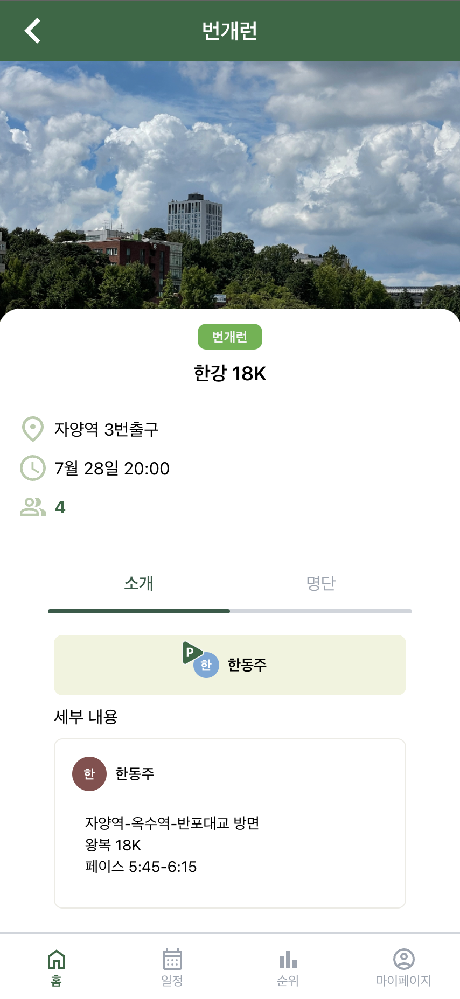

# RIKU WebApp

러닝을 즐기는 건국대학교 중앙 러닝동아리, RIKU의 공식 웹 플랫폼입니다.

> 본 레포짓토리는 FE 파트 개발 및 배포를 위한 저장소 입니다.

 

## 프로젝트 기획 배경

RIKU는 매주 다양한 러닝 활동(정규런, 번개런, 훈련 등)을 운영하고 있으며, 관련 공지와 소통은 주로 **카카오톡 공지방**을 통해 이루어지고 있었습니다.  
하지만 모든 공지사항과 러닝 정보가 하나의 채팅방에 혼재되다 보니,

- **참여자 입장에서는 필요한 정보를 찾기 어려워지고**
- **운영진은 반복적인 질문 응답과 안내에 많은 시간을 소모**하게 되었습니다.

> 이러한 **비효율을 해결하고**,  
> **운영과 참여 모두를 더 편리하게 만들기 위해** 본 프로젝트를 기획하게 되었습니다.

 

## 주요 기능

| 기능                    | 설명                                                                    |
| ----------------------- | ----------------------------------------------------------------------- |
| 🏃‍♀️ 러닝 게시판          | 번개런 / 정규런 / 훈련 / 행사 등 다양한 러닝 이벤트 생성 및 참여        |
| ✅ 출석 코드            | 주최자 코드 생성 & 참여자 코드 인증으로 간편한 출석 처리                |
| 🧑‍🤝‍🧑 참가 명단            | 러닝별 실시간 참가자 명단 및 출석 상태 확인                             |
| 💬 댓글 기능            | 자유롭게 소통할 수 있는 댓글 및 대댓글 기능                             |
| 📷 이미지 업로드        | 대표 이미지 및 코스 사진 등 파일 업로드 및 미리보기 기능                |
| 🏅 포인트 & 랭킹 시스템 | 활동에 따라 포인트를 획득하고, 누적 점수 기반 랭킹 페이지에서 확인 가능 |
| 🎯 관리자 기능          | 부원 명단 관리시스템                                                    |

 

## 🖼️ 메인 화면

## 📋 러닝 목록

## 🏃 상세 페이지 (참여 & 출석)

 

## 🏅 랭킹 페이지

## Frontend 기술스택

- 언어/프레임워크: TypeScript, React
- 스타일링: Tailwind CSS, Framer motion, Swiper
- 빌드 툴링: Vite
- 패키지 매니저: npm
- API 통신 : Axios

 

# FE Members: 이운태 & 허준호

안녕하세요! 저희는 러닝과 개발에 열정을 가진 개발자들 ⭐️**이운태**와 **허준호**⭐️입니다.  
저희의 풀코스 마라톤 PB(Personal Best)는 아래와 같습니다.

- **이운태: 3시간 35분 01초**
- **허준호: 3시간 00분 30초**

저희는 항상 겸손하게, 매일 조금 더 나아지기 위해 노력합니다.  
러닝처럼 개발에서도 꾸준함과 성장을 믿으며, 팀과 함께하는 즐거움을 추구합니다.

 

## About Us

- **취미**: 러닝, 산책, 새로운 기술 탐구, 랩
- **개발 철학**:
  > 러닝처럼, 매일 한 발짝씩 나아가는 꾸준함이 성공의 열쇠다.  
  > 인생은 겸손에 대한 끝없는 수업이다.

 

## 저희 팀의 특기

- 사람들을 미소 짓게 만드는 독특한 매력
- 화려한 랩핑
- 42.195km를 안 쉬고 뛰는 강한 정신력

 
